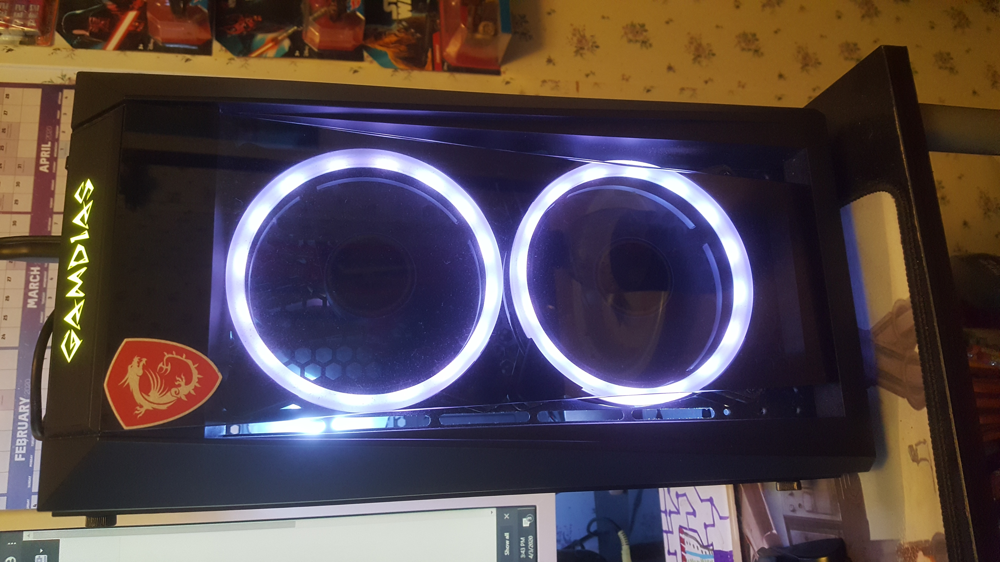
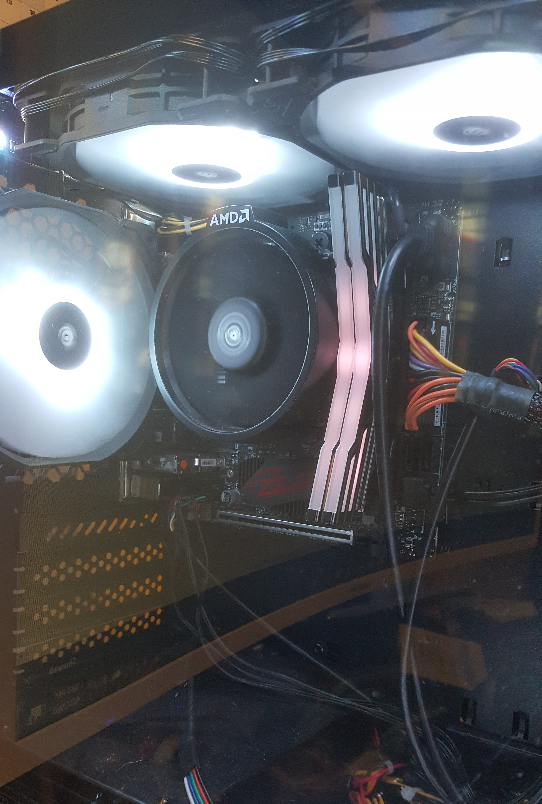

# Roland Estep Portfolio
-------------------------

***This portfolio is a culmination of everything that I achieved in my time at Mitchell and during my studying of Information Technology!***

I want to first say thank you to all my instructors for pushing me to be the best I can be!  I could not have done this without all my family and friends' help to help me study and lab it up every chance I could get.  This portfolio is my story of how I went from learning basic connections to a Netgear switch to being here now to showcase my many projects that I have done!

## About Me
-------------------------

I ~~want to be~~ AM an aspiring IT professional that wants to become one with many hats, and in order to do so, I will do my <strong><ins>absolute best</ins></strong> to get there and have many different skills that I can use to help better the world in all that is **technology**.  I have always been curious and intrigued by how technology works the way it does.  To be able to communicate with the world still fascinates me even now after learning all that I have.  It is all thanks to God and being in contact with fellow peers and mentors that help me along the way.

## Mr. Cain's Classes
-------------------------

They not only allowed me to learn about basic end user skills like deploying Windows 10 machines and setting up printers that would cause a major headache, but his classes also helped me to be a better professional in IT and in life as he gave us insight on what we could see going into the field and encouraged me personally to keep shooting for the stars and beyond!  With his classes, I learned how to setup Windows 8, 8.1, and 10 in a fashion that would be suitable for end users.  He also had us do a Windows Server lab that we needed to setup a file server and allow access to users so they could not only save documents but also print them off as well.  This [project](https://mitchellcc-my.sharepoint.com/personal/dmshoaf_students_mitchellcc_edu/_layouts/15/Doc.aspx?sourcedoc={b391466f-adb64058-832e-4b9459e37533}&action=edit&wd=target%28Member%20Positions.one%7C04331978-d62c-4199-a4f5-4ba02af13c45%2FPositions%7Cb6ffd3984e44-457e-bf6d-05ef49f5b1cf%2F%29) I was the lead in making sure that things were progressing, and in the project, I learned how to be a better leader and allow my team to work as one to get the job done.

## Ms. Shoemaker's Classes
-------------------------

These classes not only challenged me to think in a precise way, but they also made me push myself to be better.  The coding classes were super fun as me, Ethan Yount and Robert Rexrode made a website using HTML, PHP and CSS.  We worked together to make an amazing looking interface that worked.  The site was a rock n roll site that users could go to if they wanted to know the latest shows that were playing near them.  The site would ask the user what favorite type of music they preferred and got their name and information to search for concerts happening around their area.  It would also suggest other bands and concerts as well.  With the coding class, I was immersed into the world of programming and really enjoyed it.  For the hardware and software support class, I learned a lot about what it takes to build a PC and the proper troubleshooting skills I would need to be an efficient technician.  With Ms. Shoemaker's help and teaching/guidance, I was able to gain the skills it would take to build my own [PC](images/pc_inside.jpg)!  With the knowledge I gained through her classes, I can confidently say that I have the necessary skills to be an amazing IT professional and even a DevOps engineer someday!

## Ms. Watt's Class
-------------------------

Ms. Watt's class for Python really challenged me hard because this was an instructor who knew what to look for in code and made sure that her students became meticulous in all their work by really challenging us to get the code and make sure there was no room for mistakes!!  That class although rough gave me the skill to really be thorough with my work and make sure that I fixed anything and everything I could.  With that class, the final project that I had done was make a Python script that made a subnet table for departments and made the subnet table out using Python and using the inputs from the user.  The code is below!
```Python
# Programmer:   Roland Estep
# Date:         3 December 2019
# Chapter:      not from book
# Exercise:     Final Project
# Purpose:      Subnet IP addresses and calculate the total hosts, the average
#               number of hosts, and display the subnet chart

def main():

    # variables being used
    nameDepartment = ''     # string
    numDepartments = 0      # int
    firstNAOctet = 0        # int
    secondNAOctet = 0       # int
    thirdNAOctet = 0        # int
    fourthNAOctet = 0       # int
    networkAddress = ''     # string
    firstFAOctet = 0        # int
    secondFAOctet = 0       # int
    thirdFAOctet = 0        # int
    fourthFAOctet = 0       # int
    firstAvailAddress = ''  # string
    firstLAOctet = 0        # int
    secondLAOctet = 0       # int
    thirdLAOctet = 0        # int
    fourthLAOctet = 0       # int
    lastAvailAddress = ''   # int
    firstBAOctet = 0        # int
    secondBAOctet = 0       # int
    thirdBAOctet = 0        # int
    fourthBAOctet = 0       # int
    broadcastAddress = ''   # string
    numNetBits = 0          # int
    numHostBits = 0         # int
    numHosts = 0            # int
    totalHosts = 0          # int
    averageHosts = 0        # int
    firstSMOctet = 0        # int
    secondSMOctet = 0       # int
    thirdSMOctet = 0        # int
    fourthSMOctet = 0       # int
    subnetMask = ''         # string
    increment = 0           # int

    # write the heading of the chart
    outputFile = writeChartHeading()

    # get the name of the department
    nameDepartment = getNameDepartment()

    # start the while loop
    while nameDepartment != '':

        # get the first octet of the network address
        firstNAOctet = getFirstOctet()

        # get the sedond octet of the network address
        secondNAOctet = getSecondOctet(firstNAOctet)

        # get the third octet of the network address
        thirdNAOctet = getThirdOctet()

        # get the fourth octet of the network address
        fourthNAOctet = getFourthOctet()

        # get the network address
        networkAddress = str(firstNAOctet) + '.' + str(secondNAOctet) + '.' + str(thirdNAOctet) + '.' + str(fourthNAOctet)

        # get the number of network bits being used
        numNetBits = getNumberNetBits()

        # calculate the increment being used
        increment = determineIncrement(numNetBits)

        # calculate the subnet mask
        subnetMask = calcSubnetMask(numNetBits)

        # calculate the number of hosts for the subnet
        numHosts = calcNumHosts(numNetBits)

        # keep a running total of total hosts
        totalHosts += numHosts

        # keep a running total of number of departments
        numDepartments += 1

        # calculate the average number of hosts per subnet
        averageHosts = calcAverageHosts(totalHosts,numDepartments)# calculate the first available address of the subnetwork
        firstAvailAddress = calcFAAddress(firstNAOctet,secondNAOctet,thirdNAOctet,fourthNAOctet)

        # calculate the last available address of the subnetwork
        lastAvailAddress = calcLAAddress(firstNAOctet,secondNAOctet,thirdNAOctet,fourthNAOctet,increment,numNetBits)

        # calculate the broadcast of the subnetwork
        broadcastAddress = calcBCAddress(firstNAOctet,secondNAOctet,thirdNAOctet,fourthNAOctet,increment,numNetBits)

        # append the network to the output file
        writeNetwork(nameDepartment,networkAddress,firstAvailAddress,lastAvailAddress,broadcastAddress,subnetMask,numHosts,outputFile)

        # get the next name of the department
        nameDepartment = getNameDepartment()

    # append the total hosts, average hosts, and the number of departments
    # as well as the author statement
    writeEndingLines(totalHosts,averageHosts,numDepartments,outputFile)
    

################################################################################
# This function will ask for the name of the department
def getNameDepartment():
    # variables being used
    nameDepartment = ''     # string

    # get the name of the department
    nameDepartment = str(input('Enter the department you plan to subnet (or press Enter to quit):  '))
    return nameDepartment

################################################################################
# This function will get the first octet of the network address to be subnetted
def getFirstOctet():
    # variables being used
    firstNAOctet = 0        # int

    # get the first octet
    firstNAOctet = int(input('Enter the first octet of the network address to be subnetted:  '))

    # validate the first octet
    while firstNAOctet != 10 and firstNAOctet != 172 and firstNAOctet != 192:
        print('Invalid octet input.  Input must be either 10, 172, or 192.')
        firstNAOctet = int(input('Enter the first octet of the network address to be subnetted:  '))
    return firstNAOctet

################################################################################
# This function will get the second octet of the network address to be subnetted
def getSecondOctet(firstNAOctet):
    # variables being used
    secondNAOctet = 0       # int

    # get the second octet
    secondNAOctet = int(input('Enter the second octet of the network address to be subnetted:  '))

    # validate the second octet
    if firstNAOctet == 10:
        while secondNAOctet < 0 or secondNAOctet > 255:
            print('Invalid octet input.  Input must be between 0 and 255.')
            secondNAOctet = int(input('Enter the second octet of the network address to be subnetted:  '))
    elif firstNAOctet == 172:
        while secondNAOctet < 16 or secondNAOctet > 31:
            print('Invalid octet input.  Input must be between 16 and 31.')
            secondNAOctet = int(input('Enter the second octet of the network address to be subnetted:  '))
    else:
        while secondNAOctet != 168:
            print('Invalid octet input.  Input must be 168.')
            secondNAOctet = int(input('Enter the second octet of the network address to be subnetted:  '))
    return secondNAOctet

################################################################################
# This function will get the third octet of the network address to be subnetted
def getThirdOctet():
    # variables being used
    thirdNAOctet = 0        # int

    # get the third octet
    thirdNAOctet = int(input('Enter the third octet of the network address to be subnetted:  '))

    # validate the third octet
    while thirdNAOctet < 0 or thirdNAOctet > 255:
        print('Invalid octet input.  Input must be between 0 and 255.')
        thirdNAOctet = int(input('Enter the third octet of the network address to be subnetted:  '))
    return thirdNAOctet

################################################################################
# This function will get the fourth octet of the network address to be subnetted
def getFourthOctet():
    # variables being used
    fourthNAOctet = 0       # int

    # get the fourth octet
    fourthNAOctet = int(input('Enter the fourth octet of the network address to be subnetted:  '))

    # validate the fourth octet
    while fourthNAOctet < 0 or fourthNAOctet > 255:
        print('Invalid octet input.  Input must be between 0 and 255.')
        fourthNAOctet = int(input('Enter the fourth octet of the network address to be subnetted:  '))
    return fourthNAOctet

################################################################################
# This function will get the number of bits being used in the subnet mask
def getNumberNetBits():
    # variables being used
    numNetBits = 0      # int

    # get the number of network bits to be used
    numNetBits = int(input('Enter the amount of network bits that will be used in the subnet mask:  '))

    # validate the number
    while numNetBits < 8 or numNetBits > 31:
        print('Invalid number of bits.  Must be between 8 and 31.')
        numNetBits = int(input('Enter the amount of bits that will be used in the subnet mask:  '))
    return numNetBits

################################################################################
# This function will calculate the network increment
def determineIncrement(numNetBits):
    # variables being used
    increment = 0       # int

    # determine the increment
    if numNetBits == 9 or numNetBits == 17 or numNetBits == 25:
        increment = 128
    elif numNetBits == 10 or numNetBits == 18 or numNetBits == 26:
        increment = 64
    elif numNetBits == 11 or numNetBits == 19 or numNetBits == 27:
        increment = 32
    elif numNetBits == 12 or numNetBits == 20 or numNetBits == 28:
        increment = 16
    elif numNetBits == 13 or numNetBits == 21 or numNetBits == 29:
        increment = 8
    elif numNetBits == 14 or numNetBits == 22 or numNetBits == 30:
        increment = 4
    elif numNetBits == 15 or numNetBits == 23 or numNetBits == 31:
        increment = 2
    else:
        increment = 1
    return increment

################################################################################
# This function will calculate the first available address for the network
def calcFAAddress(firstNAOctet,secondNAOctet,thirdNAOctet,fourthNAOctet):
    # variables being used
    firstFAOctet = 0        # int
    secondFAOctet = 0       # int
    thirdFAOctet = 0        # int
    fourthFAOctet = 0       # int

    # calculate the first available address
    firstFAOctet = firstNAOctet
    secondFAOctet = secondNAOctet
    thirdFAOctet = thirdNAOctet
    fourthFAOctet = fourthNAOctet + 1

    # concatenate into a string
    firstAvailAddress = str(firstFAOctet) + '.' + str(secondFAOctet) + '.' + str(thirdFAOctet) + '.' + str(fourthFAOctet)
    return firstAvailAddress

################################################################################
# This function will calculate the last available address for the network
def calcLAAddress(firstNAOctet,secondNAOctet,thirdNAOctet,fourthNAOctet,increment,numNetBits):

    # variables being used
    firstLAOctet = 0        # int
    secondLAOctet = 0       # int
    thirdLAOctet = 0        # int
    fourthLAOctet = 0       # int

    # calculate the last available address
    firstLAOctet = firstNAOctet
    if numNetBits == 8:
        secondLAOctet = 255
        thirdLAOctet = 255
        fourthLAOctet = 254
    elif numNetBits > 8 and numNetBits <= 15:
        secondLAOctet = increment - 1
        thirdLAOctet = 255
        fourthLAOctet = 254
    elif numNetBits == 16:
        secondLAOctet = secondNAOctet
        thirdLAOctet = 255
        fourthLAOctet = 254
    elif numNetBits > 16 and numNetBits <= 23:
        secondLAOctet = secondNAOctet
        thirdLAOctet = increment - 1
        fourthLAOctet = 254
    elif numNetBits == 24:
        secondLAOctet = secondNAOctet
        thirdLAOctet = thirdNAOctet
        fourthLAOctet = 254
    else:
        secondLAOctet = secondNAOctet
        thirdLAOctet = thirdNAOctet
        fourthLAOctet = increment - 2

    # concatenate into a string
    lastAvailAddress = str(firstLAOctet) + '.' + str(secondLAOctet) + '.' + str(thirdLAOctet) + '.' + str(fourthLAOctet)
    return lastAvailAddress

################################################################################
# This function will calculate the broadcast address for the network
def calcBCAddress(firstNAOctet,secondNAOctet,thirdNAOctet,fourthNAOctet,increment,numNetBits):
    # variables being used
    firstBAOctet = 0        # int
    secondBAOctet = 0       # int
    thirdBAOctet = 0        # int
    fourthBAOctet = 0       # int

    # calculate the broadcast address
    firstBAOctet = firstNAOctet
    if numNetBits == 8:
        secondBAOctet = 255
        thirdBAOctet = 255
        fourthBAOctet = 255
    elif numNetBits > 8 and numNetBits <= 15:
        secondBAOctet = increment - 1
        thirdBAOctet = 255
        fourthBAOctet = 255
    elif numNetBits == 16:
        secondBAOctet = secondNAOctet
        thirdBAOctet = 255
        fourthBAOctet = 255
    elif numNetBits > 16 and numNetBits <= 23:
        secondBAOctet = secondNAOctet
        thirdBAOctet = increment - 1
        fourthBAOctet = 255
    elif numNetBits == 24:
        secondBAOctet = secondNAOctet
        thirdBAOctet = thirdNAOctet
        fourthBAOctet = 255
    else:
        secondBAOctet = secondNAOctet
        thirdBAOctet = thirdNAOctet
        fourthBAOctet = increment - 1

    # concatenate int a string
    broadcastAddress = str(firstBAOctet) + '.' + str(secondBAOctet) + '.' + str(thirdBAOctet) + '.' + str(fourthBAOctet)
    return broadcastAddress

################################################################################
# This function calculates how many host addresses are available in each subnet
def calcNumHosts(numNetBits):
    # variables being used
    numHostBits = 0         # int
    numHosts = 0            # int

    # calculate the number of hosts
    numHostBits = 32 - numNetBits
    numHosts = (2**numHostBits) - 2
    return numHosts

################################################################################
# This function will calculate the average number of hosts per network
def calcAverageHosts(totalHosts,numDepartments):
    # variables being used
    averageHosts = 0        # int

    # calculate the average number of hosts
    averageHosts = totalHosts // numDepartments
    return averageHosts

################################################################################
# This function will determine the subnet mask of the network
def calcSubnetMask(numNetBits):
    # variables being used
    firstSMOctet = 0        # int
    secondSMOctet = 0       # int
    thirdSMOctet = 0        # int
    fourthSMOctet = 0       # int

    # calculate the subnet mask
    if numNetBits >= 24:
        firstSMOctet = 255
        numNetBits = numNetBits - 8
        secondSMOctet = 255
        numNetBits = numNetBits - 8
        thirdSMOctet = 255
        numNetBits = numNetBits - 8
        if numNetBits == 0:
            fourthSMOctet = 0
        elif numNetBits == 1:
            fourthSMOctet = 128
        elif numNetBits == 2:
            fourthSMOctet = 192
        elif numNetBits == 3:
            fourthSMOctet = 224
        elif numNetBits == 4:
            fourthSMOctet = 240
        elif numNetBits == 5:
            fourthSMOctet = 248
        elif numNetBits == 6:
            fourthSMOctet = 252
        else:
            fourthSMOctet = 254
    elif numNetBits >= 16:
        firstSMOctet = 255
        numNetBits = numNetBits - 8
        secondSMOctet = 255
        numNetBits = numNetBits - 8
        if numNetBits == 0:
            thirdSMOctet = 0
        elif numNetBits == 1:
            thirdSMOctet = 128
        elif numNetBits == 2:
            thirdSMOctet = 192
        elif numNetBits == 3:
            thirdSMOctet = 224
        elif numNetBits == 4:
            thirdSMOctet = 240
        elif numNetBits == 5:
            thirdSMOctet = 248
        elif numNetBits == 6:
            thirdSMOctet = 252
        else:
            thirdSMOctet = 254
        fourthSMOctet = 0
    else:
        firstSMOctet = 255
        numNetBits = numNetBits - 8
        if numNetBits == 0:
            secondSMOctet = 0
        elif numNetBits == 1:
            secondSMOctet = 128
        elif numNetBits == 2:
            secondSMOctet = 192
        elif numNetBits == 3:
            secondSMOctet = 224
        elif numNetBits == 4:
            secondSMOctet = 240
        elif numNetBits == 5:
            secondSMOctet = 248
        elif numNetBits == 6:
            secondSMOctet = 252
        else:
            secondSMOctet = 254
        thirdSMOctet = 0
        fourthSMOctet = 0

    # concatenate into a string
    subnetMask = str(firstSMOctet) + '.' + str(secondSMOctet) + '.' + str(thirdSMOctet) + '.' + str(fourthSMOctet)
    return subnetMask

################################################################################
# This function writes the chart heading
def writeChartHeading():

    # open the output file for writing
    outputFile = open('subnetting.txt','w')

    # write the heading
    outputFile.write('\t\t\t\t\t\t\tSubnets of Departments\n'
                     '\n' + 
                     '  ' + format('Name','10s') + '    ' + format('Net Address','15s') + '  ' + format('FA Address','15s') + '   ' + format('LA Address','15s') + '     ' + format('Broadcast','15s') + '     ' + format('SubnetMask','15s') + '   ' + format('Number of Hosts','20s') + '\n'
                     '-------------------------------------------------------------------------------------------------------------------------------\n')
    return outputFile

################################################################################
# This function appends the subnetted network
def writeNetwork(nameDepartment,networkAddress,firstAvailAddress,lastAvailAddress,broadcastAddress,subnetMask,numHosts,outputFile):

    # append the inputs and processes
    outputFile.write('  ' + format(nameDepartment,'10s') + '    ' + format(networkAddress,'15s') + '  ' + format(firstAvailAddress,'15s') + '   ' + format(lastAvailAddress,'15s') + '     ' + format(broadcastAddress,'15s') + '     ' + format(subnetMask,'15s') + '       ' + format(numHosts,',d') + '\n')

################################################################################
# This function appends the total hosts, average number of hosts, and author statement
def writeEndingLines(totalHosts,averageHosts,numDepartments,outputFile):
    
    # append the total hosts, average hosts, and author statement
    outputFile.write('\n\t\t\t\t\t\t\t\t\t\t          Total Number of Hosts: ' + format(totalHosts,',d') + '\n')
    outputFile.write('\t\t\t\t\t\t\t\t\t\t        Average Number of Hosts: ' + format(averageHosts,',d') + '\n')
    outputFile.write('There were ' + str(numDepartments) + ' department(s) subnetted.' + '\n')
    outputFile.write('This document was produced by Roland Estep.')

    # close the file
    outputFile.close()


main()
```

With Ms. Watt's teaching, I really got an understanding of how a programmers mind should operate and I grew a fondness for coding, so much that I decided to pursue more and more knowledge about coding and languages that I don't quite know yet!

## Mr. Hicks' Classes
------------------------

Mr. Hicks' class for Linux was a great class to be in.  He taught us about the ins and outs of Linux and we did many labs to understand what Linux does and how to set up many different things including setting up directories and changing permissions for users, groups, and other users, changing ownership of the file to a different user, setting up a LAMP stack and creating servers like web servers, file servers, ssh servers, etc.  I learned a lot from Mr. Hicks in that using Linux can be much easier and smoother than Windows because Linux was built for freedom, and with that freedom, I was able to build a Raspberry Pi setup with a TFTP server and write a Python script that would create a startup config for a Cisco router and transfer that file to the router itself.  ~~The script is below!~~ This version of the script is actually reformed and not complete.  I am currently working to get my script up and running soon!
```Python
def main():

    # variables being used
    verify = ''
    hostname = ''
    username = ''
    password = ''
    typeInterface = ''
    consolePassword = ''
    numBlade = 0
    numModule = 0
    ipAddress = ''
    subnetMask = ''

    # This function will get the hostname
    hostname = getHostname()

    # This function will get the username
    username = getUsername()

    # This function will get the password
    password = getPassword()

    # This function will get the type of interface
    typeInterface = getTypeInterface()

    # This function will get the blade number
    numBlade = getNumBlade()

    # This function will get the module number
    numModule = getNumModule()

    # This function will get the interface number
    numInterface = getNumInterface()

    # This function will get the IP address for the interface
    ipAddress = getIPAddress()

    # This function will get the subnet mask for the interface
    subnetMask = getSubnetMask()

    # This function will get the console password
    consolePassword = getConsolePassword()

    print(hostname,username,password,typeInterface,numBlade,numModule,numInterface,ipAddress,subnetMask,consolePassword)
    print()

###########################################################
# This function will ask for the hostname of the device
def getHostname():
    hostname = str(input('Please enter the hostname you would like to use for this device:  '))
    verify = str(input('Are you sure this is the hostname you would like to use? ("y" for yes, "n" for no):  '))
    verify = verify.lower()
    while  verify != 'y' and verify != 'n':
        print('This is an invalid input!')
        verify = str(input('Are you sure this is the hostname you would like to use? ("y" for yes, "n" for no):  '))
        verify = verify.lower()
    while verify == 'n':
        print()
        print()
        hostname = str(input('Please enter the hostname you would like to use for this device:  '))
        verify = str(input('Are you sure this is the hostname you would like to use? ("y" for yes, "n" for no):  '))
        verify = verify.lower()
        while  verify != 'y' and verify != 'n':
            print('This is an invalid input!')
            verify = str(input('Are you sure this is the hostname you would like to use? ("y" for yes, "n" for no):  '))
            verify.lower()
    print()
    print()
    return hostname

############################################################################################
# This function will ask the user for their username they want to configure for the device
def getUsername():
    username = str(input('Please enter the username you would like to use for this device:  '))
    verify = str(input('Are you sure this is the username you would like to use? ("y" for yes, "n" for no):  '))
    verify = verify.lower()
    while  verify != 'y' and verify != 'n':
        print('This is an invalid input!')
        verify = str(input('Are you sure this is the username you would like to use? ("y" for yes, "n" for no):  '))
        verify = verify.lower()
    while verify == 'n':
        print()
        print()
        username = str(input('Please enter the username you would like to use for this device:  '))
        verify = str(input('Are you sure this is the username you would like to use? ("y" for yes, "n" for no):  '))
        verify = verify.lower()
        while  verify != 'y' and verify != 'n':
            print('This is an invalid input!')
            verify = str(input('Are you sure this is the username you would like to use? ("y" for yes, "n" for no):  '))
            verify = verify.lower()
    print()
    print()
    return username

####################################################################################
# This function will ask the user for the password being used for their username
def getPassword():
    password = str(input('Please enter the password you would like to use for your username:  '))
    verify = str(input('Are you sure this is the password you would like to use? ("y" for yes or "n" for no):  '))
    verify = verify.lower()
    while verify != 'y' and verify != 'n':
        print('This is an invalid input!')
        verify = str(input('Are you sure this is the password you would like to use? ("y" for yes or "n" for no):  '))
        verify = verify.lower()
    while verify == 'n':
        print()
        print()
        password = str(input('Please enter the password you would like to use for your username:  '))
        verify = str(input('Are you sure this is the password you would like to use? ("y" for yes or "n" for no):  '))
        verify = verify.lower()
        while verify != 'y' and verify != 'n':
            print('This is an invalid input!')
            verify = str(input('Are you sure this is the password you would like to use? ("y" for yes or "n" for no):  '))
            verify = verify.lower()
    print()
    print()
    return password

#####################################################################
# This function will get the interface that will be configured
def getTypeInterface():
    typeInterface = str(input('Please enter the interface you would like to configure ("g" for GigabitEthernet, "f" for FastEthernet, "lo" for loopback, or "s" for serial):  '))
    typeInterface = typeInterface.lower()
    while typeInterface != 'g' and typeInterface != 'f' and typeInterface != 'lo' and typeInterface != 's':
        print('Invalid type of interface!')
        typeInterface = str(input('Please enter the interface you would like to configure ("g" for GigabitEthernet, "f" for FastEthernet, "lo" for loopback, or "s" for serial):  '))
        typeInterface = typeInterface.lower()
    verify = str(input('Are you sure this is the interface you want to configure? ("y" for yes or "n" for no):  '))
    verify = verify.lower()
    while verify != 'y' and verify != 'n':
        print('This is an invalid input!')
        verify = str(input('Are you sure this is the interface you want to configure? ("y" for yes or "n" for no):  '))
        verify = verify.lower()
    while verify == 'n':
        print()
        print()
        typeInterface = str(input('Please enter the interface you would like to configure ("g" for GigabitEthernet, "f" for FastEthernet, "lo" for loopback, or "s" for serial):  '))
        typeInterface = typeInterface.lower()
        while typeInterface != 'g' and typeInterface != 'f' and typeInterface != 'lo' and typeInterface != 's':
            print('Invalid type of interface!')
            typeInterface = str(input('Please enter the interface you would like to configure ("g" for GigabitEthernet, "f" for FastEthernet, "lo" for loopback, or "s" for serial):  '))
            typeInterface = typeInterface.lower()
        verify = str(input('Are you sure this is the interface you want to configure? ("y" for yes or "n" for no):  '))
        verify = verify.lower()
        while verify != 'y' and verify != 'n':
            print('This is an invalid input!')
            verify = str(input('Are you sure this is the interface you want to configure? ("y" for yes or "n" for no):  '))
            verify = verify.lower()
    print()
    print()
    return typeInterface

##############################################################################
# This function will get the console line password that will be configured
def getConsolePassword():
    consolePassword = str(input('Please enter the console password you would like to configure:  '))
    verify = str(input('Are you sure this is the password you want to configure? ("y" for yes or "n" for no):  '))
    verify = verify.lower()
    while verify != 'y' and verify != 'n':
        print('This is an invalid input!')
        verify = str(input('Are you sure this is the password you want to configure? ("y" for yes or "n" for no):  '))
        verify = verify.lower()
    while verify == 'n':
        print()
        print()
        consolePassword = str(input('Please enter the console password you would like to configure:  '))
        verify = str(input('Are you sure this is the password you want to configure? ("y" for yes or "n" for no):  '))
        verify = verify.lower()
        while verify != 'y' and verify != 'no':
            print('This is an invalid input!')
            verify = str(input('Are you sure this is the password you want to configure? ("y" for yes or "n" for no):  '))
            verify = verify.lower()
    print()
    print()
    return consolePassword

######################################################################
# This function will get the blade number for the interface
def getNumBlade():
    verify = str(input('Does this interface have a blade number? ("y" for yes or "n" for no):  '))
    verify = verify.lower()
    while verify != 'y' and verify !='n':
        print('This is an invalid input!')
        verify = str(input('Does this interface have a blade number? ("y"for yes or "n" for no):  '))
        verify = verify.lower()
    if verify =='y':
        numBlade = int(input('Please enter the blade number for the interface:  '))
        verify = str(input('Are you sure this is the correct blade number? ("y" for yes or "n" for no):  '))
        verify = verify.lower()
        while verify != 'y' and verify != 'n':
            print('This is an invalid input!')
            verify = str(input('Are you sure this is the correct blade number? ("y" for yes or "n" for no):  '))
            verify = verify.lower()
        while verify == 'n':
            print()
            print()
            numBlade = int(input('Please enter the blade number for the interface:  '))
            verify = str(input('Are you sure this is the correct blade numeber? ("y" for yes or "n" for no):  '))
            verify = verify.lower()
            while verify != 'y' and verify != 'n':
                print('This is an invalid input!')
                verify = str(input('Are you sure this is the correct blade number? ("y" for yes or "n" for no):  '))
                verify = verify.lower()
        print()
        print()
        return numBlade
    else:
        verify = str(input('Are you sure there is no blade number? ("y" for yes or "n" for no):  '))
        verify = verify.lower()
        while verify != 'y' and verify !='n':
            print('This is an invalid input!')
            verify = str(input('Are you sure there is no blade number? ("y" for yes or "n" for no):  '))
            verify = verify.lower()
        if verify == 'n':
            verify = str(input('Does this interface have a blade number? ("y" for yes or "n" for no):  '))
            verify = verify.lower()
            while verify != 'y' and verify !='n':
                print('This is an invalid input!')
                verify = str(input('Does this interface have a blade number? ("y"for yes or "n" for no):  '))
                verify = verify.lower()
            if verify == 'y':
                numBlade = int(input('Please enter the blade number for the interface:  '))
                verify = str(input('Are you sure this is the correct blade number? ("y" for yes or "n" for no):  '))
                verify = verify.lower()
                while verify != 'y' and verify != 'n':
                    print('This is an invalid input!')
                    verify = str(input('Are you sure this is the correct blade number? ("y" for yes or "n" for no):  '))
                    verify = verify.lowwer()
                while verify == 'n':
                    print()
                    print()
                    numBlade = int(input('Please enter the blade number for the interface:  '))
                    verify = str(input('Are you sure this is the correct blade number? ("y" for yes or "n" no no):  '))
                    verify = verify.lower
                    while verify != 'y' and verify != 'n':
                        print('This is an invalid input!')
                        verify = str(input('Are you sure this is the correct blade number? ("y" for yes or "n" for no):  '))
                        verfiy = verify.lower()
                print()
                print()
                return numBlade
        else:
            print()
        print()
#######################################################################
# This function will get the module number for the interface
def getNumModule():
    verify = str(input('Does this interface have a module number? ("y" for yes or "n" for no):  '))
    verify = verify.lower()
    while verify != 'y' and verify !='n':
        print('This is an invalid input!')
        verify = str(input('Does this interface have a module number? ("y"for yes or "n" for no):  '))
        verify = verify.lower()
    if verify =='y':
        numModule = int(input('Please enter the module number for the interface:  '))
        verify = str(input('Are you sure this is the correct module number? ("y" for yes or "n" for no):  '))
        verify = verify.lower()
        while verify != 'y' and verify != 'n':
            print('This is an invalid input!')
            verify = str(input('Are you sure this is the correct module number? ("y" for yes or "n" for no):  '))
            verify = verify.lower()
        while verify == 'n':
            print()
            print()
            numModule = int(input('Please enter the module number for the interface:  '))
            verify = str(input('Are you sure this is the correct module numeber? ("y" for yes or "n" for no):  '))
            verify = verify.lower()
            while verify != 'y' and verify != 'n':
                print('This is an invalid input!')
                verify = str(input('Are you sure this is the correct module number? ("y" for yes or "n" for no):  '))
                verify = verify.lower()
        print()
        print()
        return numModule
    else:
        verify = str(input('Are you sure there is no module number? ("y" for yes or "n" for no):  '))
        verify = verify.lower()
        while verify != 'y' and verify !='n':
            print('This is an invalid input!')
            verify = str(input('Are you sure there is no module number? ("y" for yes or "n" for no):  '))
            verify = verify.lower()
        if verify == 'n':
            verify = str(input('Does this interface have a module number? ("y" for yes or "n" for no):  '))
            verify = verify.lower()
            while verify != 'y' and verify !='n':
                print('This is an invalid input!')
                verify = str(input('Does this interface have a module number? ("y"for yes or "n" for no):  '))
                verify = verify.lower()
            if verify == 'y':
                numModule = int(input('Please enter the module number for the interface:  '))
                verify = str(input('Are you sure this is the correct module number? ("y" for yes or "n" for no):  '))
                verify = verify.lower()
                while verify != 'y' and verify != 'n':
                    print('This is an invalid input!')
                    verify = str(input('Are you sure this is the correct module number? ("y" for yes or "n" for no):  '))
                    verify = verify.lowwer()
                while verify == 'n':
                    print()
                    print()
                    numModule = int(input('Please enter the module number for the interface:  '))
                    verify = str(input('Are you sure this is the correct module number? ("y" for yes or "n" no no):  '))
                    verify = verify.lower
                    while verify != 'y' and verify != 'n':
                        print('This is an invalid input!')
                        verify = str(input('Are you sure this is the correct module number? ("y" for yes or "n" for no):  '))
                        verfiy = verify.lower()
                print()
                print()
                return numModule
        else:
            print()
        print()

#####################################################################
# This function will get the interface number to be configured
def getNumInterface():
    verify = str(input('Will this interface have an interface number? ("y" for yes or "n" for no):  '))
    while verify != 'y' and verify !='n':
        print('This is an invalid input!')
        verify = str(input('Will this interface have an interface number? ("y"for yes or "n" for no):  '))
    if verify =='y':
        numInterface = int(input('Please enter the interface number for the interface:  '))
        verify = str(input('Are you sure this is the correct interface number? ("y" for yes or "n" for no):  '))
        while verify != 'y' and verify != 'n':
            print('This is an invalid input!')
            verify = str(input('Are you sure this is the correct interface number? ("y" for yes or "n" for no):  '))
        while verify == 'n':
            print()
            print()
            numInterface = int(input('Please enter the interface number for the interface:  '))
            verify = str(input('Are you sure this is the correct interface numeber? ("y" for yes or "n" for no):  '))
            while verify != 'y' and verify != 'n':
                print('This is an invalid input!')
                verify = str(input('Are you sure this is the correct interface number? ("y" for yes or "n" for no):  '))
        print()
        print()
        return numInterface
    else:
        verify = str(input('Are you sure there is no blade number? ("y" for yes or "n" for no):  '))
        verify = verify.lower()
        while verify != 'y' and verify !='n':
            print('This is an invalid input!')
            verify = str(input('Are you sure there is no blade number? ("y" for yes or "n" for no):  '))
            verify = verify.lower()
        if verify == 'n':
            verify = str(input('Does this interface have a blade number? ("y" for yes or "n" for no):  '))
            verify = verify.lower()
            while verify != 'y' and verify !='n':
                print('This is an invalid input!')
                verify = str(input('Does this interface have a blade number? ("y"for yes or "n" for no):  '))
                verify = verify.lower()
            if verify == 'y':
                numBlade = int(input('Please enter the blade number for the interface:  '))
                verify = str(input('Are you sure this is the correct blade number? ("y" for yes or "n" for no):  '))
                verify = verify.lower()
                while verify != 'y' and verify != 'n':
                    print('This is an invalid input!')
                    verify = str(input('Are you sure this is the correct blade number? ("y" for yes or "n" for no):  '))
                    verify = verify.lowwer()
                while verify == 'n':
                    print()
                    print()
                    numBlade = int(input('Please enter the blade number for the interface:  '))
                    verify = str(input('Are you sure this is the correct blade number? ("y" for yes or "n" no no):  '))
                    verify = verify.lower
                    while verify != 'y' and verify != 'n':
                        print('This is an invalid input!')
                        verify = str(input('Are you sure this is the correct blade number? ("y" for yes or "n" for no):  '))
                        verfiy = verify.lower()
                print()
                print()
                return numInterface
        else:
            print()
        print()

#################################################################################
# This function will get the IP address for the interface being configured
def getIPAddress():
    ipAddress = str(input('Please enter the IP address being configured onto the interface:  '))
    verify = str(input('Are you sure this is the IP address to be applied to the interface? ("y" for yes or "n" for no):  '))
    while verify != 'y' and verify != 'n':
        print('This is an invalid input!')
        verify = str(input('Are you sure this is the IP address to be applied to the interface? ("y" for yes or "n" for no):  '))
    while verify == 'n':
        print()
        print()
        ipAddress = str(input('Please enter the IP address being configured onto the interface:  '))
        verify = str(input('Are you sure this is the IP address to be applied to the interface? ("y" for yes or "n" for no):  '))
        while verify != 'y' and verify != 'n':
            print('This is an invalid input!')
            verify = str(input('Are you sure this is the IP address to be applied to the interface? ("y" for yes or "n" for no):  '))
    print()
    print()
    return ipAddress

################################################################################
# This function will get the subnet mask for the interface being configured
def getSubnetMask():
    subnetMask = str(input('Please enter the subnet mask being configured onto the interface:  '))
    verify = str(input('Are you sure this is the subnet mask to be applied to the interface? ("y" for yes or "n" for no):  '))
    while verify != 'y' and verify != 'n':
        print('This is an invalid input!')
        verify = str(input('Are you sure this is the subnet mask to be configured to the interface ("y" for yes or "n" for no):  '))
    while verify == 'n':
        print()
        print()
        subnetMask = str(input('Please enter the subnet mask being configured onto the interface:  '))
        verify = str(input('Are you sure this is the subnet mask to be applied to the interface? ("y" for yes or "n" for no):  '))
        while verify !='y' and verify != 'n':
            print('This is an invalid input!')
            verify = str(input('Are you sure this is the subnet mask to be applied to the interface? ("y" for yes or "n" for no):  '))
    print()
    print()
    return subnetMask

###############################################################################
# This function will get the total number of interfaces being configured
def getTotalInterfaces():
    totalInterfaces = int(input('How many interfaces will be configured?  '))
    verify = str(input('Are you sure this is the total interfaces you will configure? ("y" for yes or "n" for no):  '))
    while verify != 'y' and verify != 'n':
        print('This is an invalid input!')
        verify = str(input('Are you aure this is the total interfaces you will configure? ("y" for yes or "n" for no):  '))
    while verify == 'n':
        print()
        print()
        totalInterfaces = int(input('How many interfaces will be configured?  '))
        verify = str(input('Are you sure this is the total inerfaces you will configure? ("y" for yes or "n" for no):  '))


main()

```
Through Hicks' online class, I have learned the business side of IT like decision making styles that can help companies with their IT department and their needs and so on.


## Mr. Bemfield's Class
-------------------------

I had a **great honor** to attend the Security class being led by Mr. Benfield.  His wisdom and many real-life examples of security breaches that he knew of or had experienced really helped me to learn one thing: security is an ongoing process that should be tended to with care and with great importance!  Learning about the different attack types and how black hat hackers could potentially cause chaos for many company's with just the stroke of the Enter key!  I learned a lot about network infrastructures and how to set them up in a secure fashion to ensure that maximum security can be attained.  This class we had many labs that had to deal with security and aspects of security and we even had a server that we had to break into.  With the help of my team, we were able to access a Linux server with root priviledges.  The informations I learned in that class wil always stay with me as I go further with my career.

In addition to that class, I am currently learning more about Cisco ASA firewalls and adding more to my skill bank by configuring ASA firewalls to filter traffic inside and outside an enterprise network.


## Mr. Theisen's Classes
-------------------------

The networking track classes at Mitchell are mainly taught by Mr. Theisen and with his teaching, I was able to learn so much about network administration and how to setup, monitor, troubleshoot, and administer large enterprise networks.  With his guidance, I have learned about networking concepts like switching and routing, the OSI model for troubleshooting, the routing protocols of networks and the internet and much more.  The classes challenged me to get better with each lab I did.  I learned and mastered Cisco IOS for switches and routers and even though I may have my blank moments, I can get the job done in the end.

Some of the configurations I haave done on Cisco Switches are applying VLANs

```
vlan 10
  name IT
vlan 20
  name HR
vlan 30
  name DEVOPS
vlan 40
  name MANAGEMENT
vlan 99
  name Native
```

Doing the VLANs, issuing the **switchport mode access** and **switchport mode trunk** commands allowed for VLAN trunking between switches or trunking to a router.  For example:

```
int range f0/1-8
  switchport mode access
  switchport access vlan 10
int range f0/9-16
  switchport mode access
  switchport access vlan 20
int range f0/17-24
  switchport mode access
  switchport access vlan 30
int g0/1
  switchport mode trunk
  switchport trunk allowed vlan 10,20,30
  switchport trunk native vlan 99
```

Once the switches are configured with VLANs, you can go into the router and make sure that subinterfaces are configured on the router interface facing the switch.

```
int g0/0
  no shutdown
int g0/0.10
  encapsulation dot1q 10
  ip address 192.168.10.1 255.255.255.0
  no shutdown
int g0/0.20
  encapsulation dot1q 20
  ip address 192.168.20.1 255.255.255.0
  no shutdown
int g0/0.30
  encapsulation dot1q 30
  ip address 192.168.30.1 255.255.255.0
  no shutdown
int g0/0.1000
  encapsulation dot1q 99
  ip address 192.168.99.1 255.255.255.0
  no shutdown
```

These configurations would be necessary to setup what is called Inter-VLAN routing and this specific type is called Router-on-a-Stick becuase traffic is being trunked on one physical interface.

There are many more configurations that I could showcase here and I am positive that if I did, this portfolio would become a book, so I will leave it at that, but this is exactly the type of knowledge that I have aquired at Mitchell, and it is with this training that I will be able to work in the IT field and be able to excel in ways that I cannot even fathom!

I also learned about setting up Windows Server to support company's in a way to allow many other workers in many different settings to efficiently do their work as well.  Setting up a domain controller was at first very challenging, but with practice, I was able to get that skill down as well.  With the training that I aquired from Mitchell, I am able to support companys' infrastructures and manage not only the network equipment like switches and routers but also servers and clients.  I have learned about client-server relationships and how a client accesses information and resources using a central server that is hosting everything that a client would need to properly function.  Using a DC that is hosting a file server and using Group Policy to dictate how the machine operates, clients can be fine-tuned to perform how the company needs them to perform.


## My Other Accomplishments
------------------------

With my knowledge of networking through the Cisco track at Mitchell and with the help from a few friends, I was able to pass the CCNA Routing and Switching exam and now with many more things to learn, I still have much more to learn!!

Click here to view my [CCENT](images/Cisco%20Certified%20Entry%20Networking%20Technician%20certificate.pdf)!

Click here to view my [CCNA R&S](images/Cisco%20Certified%20Network%20Associate%20Routing%20and%20Switching%20certificate.pdf)!

Click here to view my [CCNA](images/Cisco%20Certified%20Network%20Associate%20certificate.pdf)!

PC Front | PC Inside
-------- | ---------
 | 


### Huge shoutout to all the people who have helped me through this amazing journey!!

Gregory Cain for always giving me the encouraging speeches I needed.

Robert Theisen for keeping me engaged and helping me.

Liz Shoemaker for always listening and being there to talk to.

Loraine Watt for pushing me to be better and take on the hard challenges.

Chad Hicks for being real with me about things and encouraging me to move forward.

Jeff Benfield for being an amazing role model and get me thinking outside the box.

All of the NET 226 students for having my back through the rough studying of CCNA.

Matthew Beach for being that amazing encouragement and helping me through studying and showing me that no matter what happens in your life, you always have support from brothers.  Love ya man!

Ethan Yount for helping push me to keep studying and being my study partner for classes.  Thanks for the support!

My family for sticking with me through my constant studying and being there for me when I needed help.  Couldn't accomplish this without you all!!


*Thanks for support to anyone else I may have left out!!  If you are interested in talking more about IT or anything you may need help with, I am open to all types of discussions!!  Below are a few ways to reach out!*

[LinkedIn](https://linkedin.com/in/roland-c-estep) | [Github](https://github.com/rcestep) | Email: **roland.estep@outlook.com** | Phone: **(980) 892-2512**
