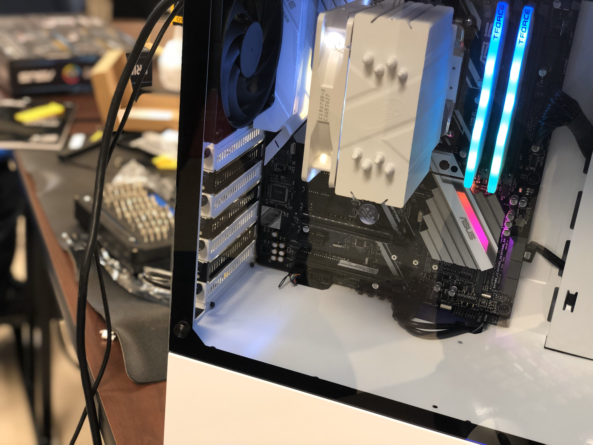
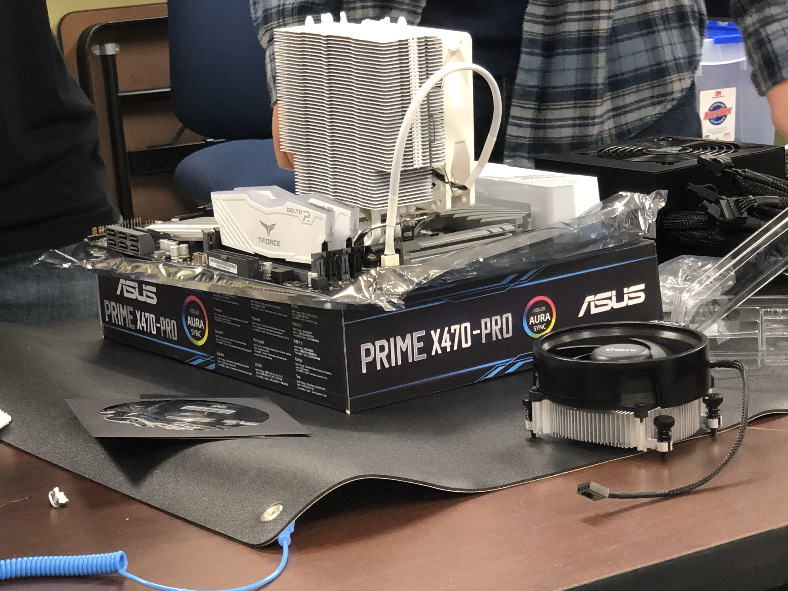
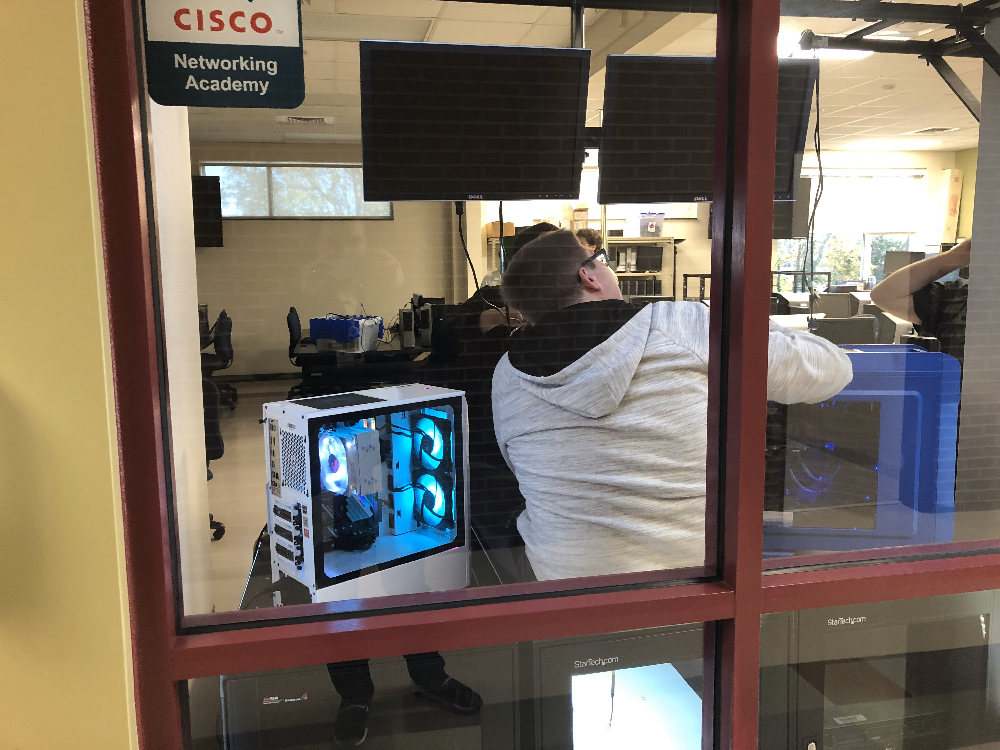

# Roland Estep Portfolio
-------------------------

***This portfolio is a culmination of everything that I achieved in my time at Mitchell and during my studying of Information Technology!***

I want to first say thank you to all my instructors for pushing me to be the best I can be!  I could not have done this without all my family and friends' help to help me study and lab it up every chance I could get.  This portfolio is my story of how I went from learning basic connections to a Netgear switch to being here now to showcase my many projects that I have done!

## About Me
-------------------------

I ~~want to be~~ AM an aspiring IT professional that wants to become one with many hats, and in order to do so, I will do my <strong><ins>absolute best</ins></strong> to get there and have many different skills that I can use to help better the world in all that is **technology**.  I have always been curious and intrigued by how technology works the way it does.  To be able to communicate with the world still fascinates me even now after learning all that I have.  It is all thanks to God and being in contact with fellow peers and mentors that help me along the way.

[Mr. Cain's Class](mrcainclass/mrcainclass.md)

[Ms. Shoemaker's Class](msshoemakerclass/msshoemakerclass.md)

[Ms. Watt's Class](mswattclass/mswattclass.md)

[Mr. Hick's Class](mrhicksclass/mrhicksclass.md)


## Mr. Benfield's Class
-------------------------

I had a **great honor** to attend the Security class being led by Mr. Benfield.  His wisdom and many real-life examples of security breaches that he knew of or had experienced really helped me to learn one thing: security is an ongoing process that should be tended to with care and with great importance!  Learning about the different attack types and how black hat hackers could potentially cause chaos for many companies with just the stroke of the Enter key!  I learned a lot about network infrastructures and how to set them up in a secure fashion to ensure that maximum security can be attained.  This class we had many labs that had to deal with security and aspects of security and we even had a server that we had to break into.  With the help of my team, we were able to access a Linux server with root privileges by running a Nmap scan and finding a server running a FTP server and able to find a vulnerability in the machine.  We found credentials for a Windows server that had an encrypted password that was all in binary.  Using the key, we used ANDing to decrypt the password and we were able to take the credentials we found to login to the Linux machine with a regular user.  From there, we accessed the /etc/passwd file and edited the user to have root privileges.  The information I learned in that class will always stay with me as I go further with my career.

In addition to that class, I am currently learning more about Cisco ASA firewalls and adding more to my skill bank by configuring ASA firewalls to filter traffic inside and outside an enterprise network.

Some of the configurations are as follows:

```
int g0/0
  nameif inside                                   # Naming the interface is key.
  ip address 192.168.0.1 255.255.255.0
  no shutdown
  exit
int g0/1
  nameif outside                                  # Naming the interface is key.
  ip address 10.0.0.1 255.255.255.252
  no shutdown
  exit
object network INSIDE_LAN                         # Making objects makes configuring access lists easier.
  subnet 192.168.0.0 255.255.255.0
  nat (inside,outside) dynamic interface          # Configuring NAT is on the objects not the interfaces.  The interfaces are specified in the command.
  exit
object network OUTSIDE_WAN
  subnet 10.0.0.0 255.255.255.252
  exit
object network REMOTE_LAN
  subnet 172.16.0.0 255.255.255.0
  exit
object-group SAFE_ICMP
  network-object object OUTSIDE_WAN
  network-object object REMOTE_LAN
  exit
access-list INSIDE extended permit icmp object INSIDE_LAN object-group SAFE_ICMP
access-list OUTSIDE extended permit icmp object-group SAFE_ICMP object INSIDE_LAN
access-group INSIDE in interface inside
access-group OUTSIDE in interface outside
```

These configurations, although hard to read, configure a firewall with IP addresses, labels networks with names, and it allows ICMP traffic from the inside LAN to the remote LAN and the WAN and allows the replies to return as well.  Learning the Cisco ASA configurations have been a challenge, but it's yet another feather in my cap!


## Mr. Theisen's Classes
-------------------------

The networking track classes at Mitchell are mainly taught by Mr. Theisen and with his teaching, I was able to learn so much about network administration and how to setup, monitor, troubleshoot, and administer large enterprise networks.  With his guidance, I have learned about networking concepts like switching and routing, the OSI model for troubleshooting, the routing protocols of networks and the internet and much more.  The classes challenged me to get better with each lab I did.  I learned and mastered Cisco IOS for switches and routers and even though I may have my blank moments, I can get the job done in the end.

Some of the configurations I have done on Cisco Switches are applying VLANs

```
vlan 10
  name IT
vlan 20
  name HR
vlan 30
  name DEVOPS
vlan 40
  name MANAGEMENT
vlan 99
  name Native
```

Doing the VLANs, issuing the **switchport mode access** and **switchport mode trunk** commands allowed for VLAN trunking between switches or trunking to a router.  For example:

```
int range f0/1-8
  switchport mode access
  switchport access vlan 10
int range f0/9-16
  switchport mode access
  switchport access vlan 20
int range f0/17-24
  switchport mode access
  switchport access vlan 30
int g0/1
  switchport mode trunk
  switchport trunk allowed vlan 10,20,30
  switchport trunk native vlan 99
```

Once the switches are configured with VLANs, you can go into the router and make sure that sub-interfaces are configured on the router interface facing the switch.

```
int g0/0
  no shutdown
int g0/0.10
  encapsulation dot1q 10
  ip address 192.168.10.1 255.255.255.0
  no shutdown
int g0/0.20
  encapsulation dot1q 20
  ip address 192.168.20.1 255.255.255.0
  no shutdown
int g0/0.30
  encapsulation dot1q 30
  ip address 192.168.30.1 255.255.255.0
  no shutdown
int g0/0.1000
  encapsulation dot1q 99
  ip address 192.168.99.1 255.255.255.0
  no shutdown
```

These configurations would be necessary to setup what is called Inter-VLAN routing and this specific type is called Router-on-a-Stick because traffic is being trunked on one physical interface.

There are many more configurations that I could showcase here and I am positive that if I did, this portfolio would become a book, so I will leave it at that, but this is exactly the type of knowledge that I have acquired at Mitchell, and it is with this training that I will be able to work in the IT field and be able to excel in ways that I cannot even fathom!

I also learned about setting up Windows Server to support company's in a way to allow many other workers in many different settings to efficiently do their work as well.  Setting up a domain controller was at first very challenging, but with practice, I was able to get that skill down as well.  With the training that I acquired from Mitchell, I can support company’s' infrastructures and manage not only the network equipment like switches and routers but also servers and clients.  I have learned about client-server relationships and how a client accesses information and resources using a central server that is hosting everything that a client would need to properly function.  Using a DC that is hosting a file server and using Group Policy to dictate how the machine operates, clients can be fine-tuned to perform how the company needs them to perform.


## Mitchell Technological Society
----------------------------------

I played an impacting role in MTS as the Club Representative and later as President to help engage students and get them deeper into IT and promote safe technological use to the community.  The society has become a beacon of light to the students who want to go above and beyond their skills.  We as a team built a PC together and displayed it out to the hallway for other IT students and faculty to see.

Say hi to Traitor!





The team also did many events like promoting technology and teaching tech to middle school children from the Iredell county schools and Mooresville schools around.  To show the future generation what technology can do really helps boost the confidence of many younger students to pursue this field.  The team also went to a business expo and showed the safe and unsafe ways to use technology in the office and showcased two examples of what to do and what not to do in the company.  We had many business owners and business professionals give feedback about it and say that they see many times that it is the what not to do example that is prevalent in the company.  We gave amazing feedback to businesses and showed what could happen in a case of a security breach all because of unaware employees.  Security is becoming a huge factor of what needs to be implemented in a network infrastructure, and to show businesses this need really gave the team a huge experience and be able to reach out to many people around the greater Iredell County area and make sure that these needs are met to better their technological use!
## My Other Accomplishments
------------------------------

With my knowledge of networking through the Cisco track at Mitchell and with the help from a few friends, I was able to pass the CCNA Routing and Switching exam and now with many more things to learn, I still have much more to learn!!

Click here to view my [CCENT](images/Cisco%20Certified%20Entry%20Networking%20Technician%20certificate.pdf)!

Click here to view my [CCNA R&S](images/Cisco%20Certified%20Network%20Associate%20Routing%20and%20Switching%20certificate.pdf)!

Click here to view my [CCNA](images/Cisco%20Certified%20Network%20Associate%20certificate.pdf)!

PC Front | PC Inside
-------- | ---------
 | 


### Huge shoutout to all the people who have helped me through this amazing journey!!

Gregory Cain for always giving me the encouraging speeches I needed.

Robert Theisen for keeping me engaged and helping me.

Liz Shoemaker for always listening and being there to talk to.

Loraine Watt for pushing me to be better and take on the hard challenges.

Chad Hicks for being real with me about things and encouraging me to move forward.

Jeff Benfield for being an amazing role model and get me thinking outside the box.

All of the NET 226 students for having my back through the rough studying of CCNA.

Matthew Beach for being that amazing encouragement and helping me through studying and showing me that no matter what happens in your life, you always have support from brothers.  Love ya man!

Ethan Yount for helping push me to keep studying and being my study partner for classes.  Thanks for the support!

My family for sticking with me through my constant studying and being there for me when I needed help.  Couldn't accomplish this without you all!!


*Thanks for support to anyone else I may have left out!!  If you are interested in talking more about IT or anything you may need help with, I am open to all types of discussions!!*

[LinkedIn](https://linkedin.com/in/roland-c-estep) | [GitHub](https://github.com/rcestep) | [Discord](https://discordhub.com/profile/532348150019522580)
-------------------------------------------------- | ------------------------------------ | ------------------------------------------------------------
Email: **roland.estep@outlook.com**                | Phone: **(980)892-2512**             |
