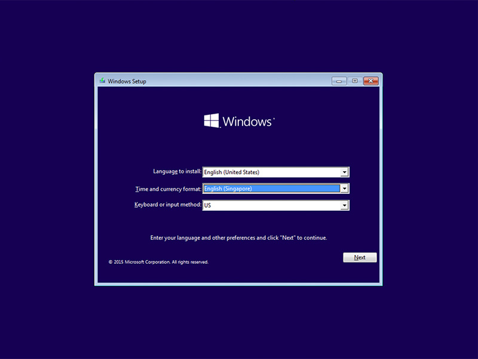

## Desktop
---------------

With Operating Systems, I know the installation process of Windows and of Linux:

* Configurations and Upgrades
  * Windows 10
    * Settings > Update & Security
    * Installation from USB or CD-ROM
    * Different Versions of Windows 10 ie. Home, Pro, Education, and Enterprise

  * Windows Server
    * Installation from USB or CD-ROM
    * Setting up server for enterprise usage and for small to medium sized businesses for optimal and best performance
    * Making profiles and add users to groups using a proper OU tree structure to help with organization and Group Policy

  * Linux
    * Installation from USB or CD-ROM
    * Formatting drives using the fdisk and mkfs commands
    * Setting permissions on files using the chmod and chown commands for specific needs

[LinkedIn](https://linkedin.com/in/roland-c-estep) | [GitHub](https://github.com/rcestep) | [Discord](https://discordhub.com/profile/532348150019522580)
-------------------------------------------------- | ------------------------------------ | ------------------------------------------------------------
Email: **roland.estep@outlook.com**                | Phone: **(980) 892-2512**             | [Reddit](https://reddit.com/user/rcmoonpie1)

