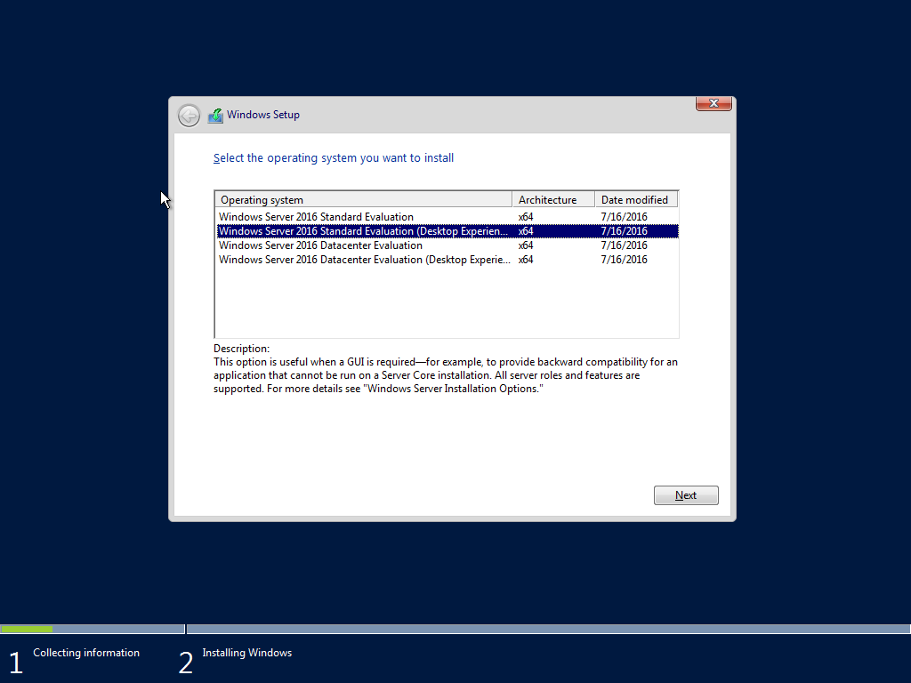

## Desktop
---------------

With Operating Systems, I know the installation process of Windows and Linux:

### Configurations and Upgrades
#### Windows 10
  * Installation from USB or CD-ROM
  * Keeping current with updates that are released
  * Different Versions of Windows 10 ie. Home, Pro, Education, and Enterprise

#### Windows Server
  * Installation from USB or CD-ROM
  * Setting up server for enterprise usage and for small to medium sized businesses for optimal and best performance
  * Making profiles and adding users to groups while using a proper Organizational Unit tree structure to help with composition and Group Policy

#### Linux
  * Installation from USB or CD-ROM
  * Formatting drives using the fdisk and mkfs commands
  * Setting permissions on files using the chmod and chown commands for specific needs

### Profiles and Local Rights
#### Windows 10
  * Using Computer Management and the Local Users and Groups tool to make a new local user for that single system; adding password security and managing the single user for the computer.

#### Windows Server
  * Using Active Directory to add and remove users and groups in the server to maintain the users and groups in a performance driven organization
  * Using Group Policy to dictate who can or cannot access certain resources
  * Using security measures like passwords or biometric authentication to secure the network and to authenticate the users as they sign in to the network and access resources across the network

#### Linux
  * Making sure users that need to be in the sudoers file are in there while also setting permissions on file shares and folders to keep the unauthorized out
  * Commands such as chmod and chown configure the rights and priviledges of the users' access to files
  * Using Samba to share files from Linux to Windows in the case of files needing shared between different Operating Systems
  * Scripting for bash to create users on a local machine.  The executed script creates a user by reading the arguments given for the command and generates a random password through a SHA256 checksum sequence for added security and shortens the password to a 12 character password.  It then creates the user with the deseignated password and forces the user on first login to change their password.

Click [here](https://rcestep.github.io/bashscripting) to see my bash scripts that I created both in a bash course I went through and some other personal handy scripts I made for ease-of-use.

### Domain Configurations
#### Windows Server
  * Configuring AD and GPO to build a solid Domain Controller by structuring the OU's correctly and efficiently
  * Configuring usernames and passwords for new upcoming users or changing passwords for higher security measures
  * Using more complex passwords to help secure the network and server resources

Click one of these links to view my portfolio! | I promise you won't regret it!
--------------------------------------------- | ---------------------------------------------------------------
[Systems Applications](../systems/systems.md) | [Networking](../networking/networking.md)
[Other](../other/other.md) | [Experience](../experience/experience.md)
[Education/Organizations](../education_organizations/education_organizations.md) | [Projects](../projects/projects.md)
[Certifications](../certifications/certifications.md) | [Home](..)

[LinkedIn](https://linkedin.com/in/roland-c-estep) | [GitHub](https://github.com/rcestep) | [Discord](https://discordhub.com/profile/532348150019522580)
-------------------------------------------------- | ------------------------------------ | ------------------------------------------------------------
Email: **roland.estep@outlook.com**                | Phone: **(980) 892-2512**             | [Reddit](https://reddit.com/user/rcmoonpie1)

