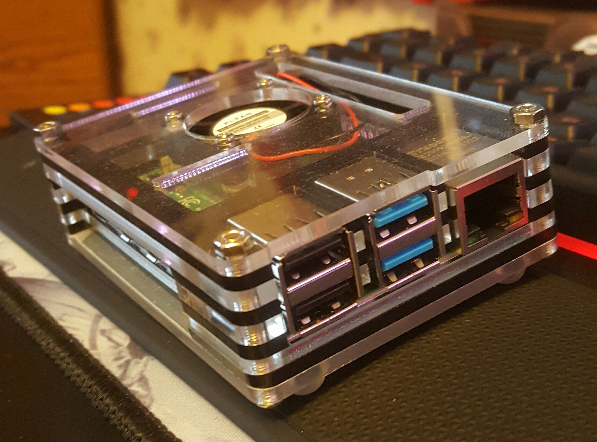
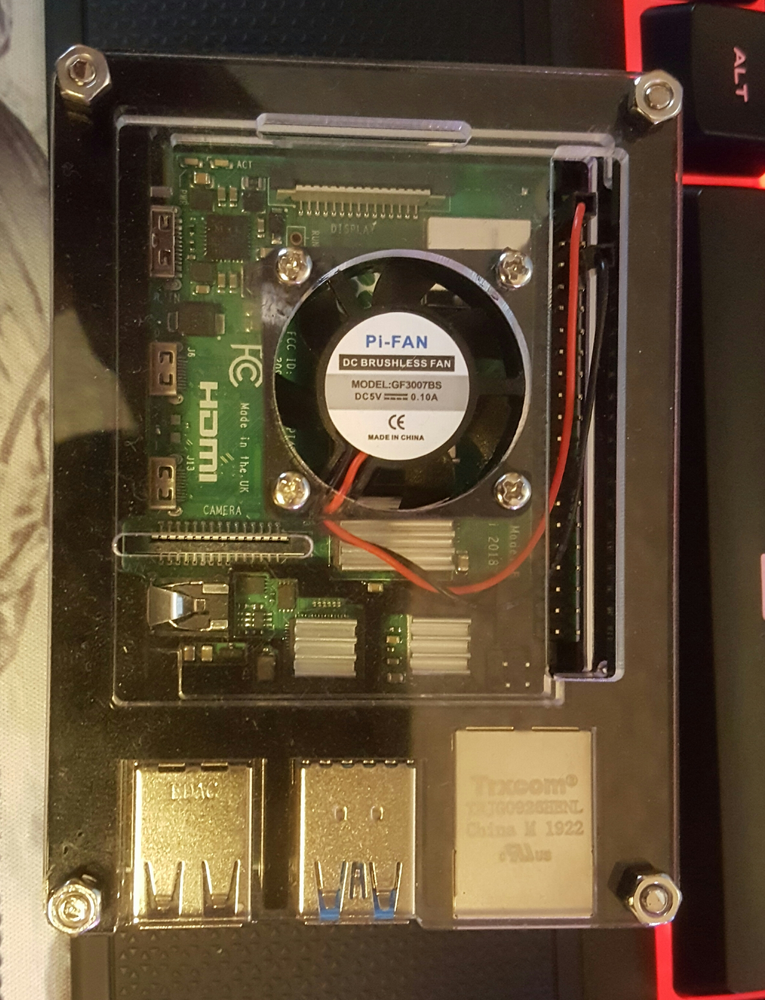

## Mr. Hicks' Classes
------------------------

Mr. Hicks' class for Linux was a great class to be in.  He taught us about the ins and outs of Linux and we did many labs to understand what Linux does and how to set up many different things including setting up directories and changing permissions for users, groups, and other users, changing ownership of the file to a different user, setting up a LAMP stack and creating servers like web servers, file servers, ssh servers, etc.  I learned a lot from Mr. Hicks in that using Linux can be much easier and smoother than Windows because Linux was built for freedom, and with that freedom, I was able to build a Raspberry Pi setup with a TFTP server and write a Python script that would create a startup config for a Cisco router and transfer that file to the router itself.  ~~The script is below!~~ This version of the script is actually reformed and not complete.  I am currently working to get my script up and running soon!

Here is my Rasperry Pi!




This Raspberry Pi is what I used to run the Python script!  When the script ran, the Pi was then connected to the router and the file was pulled from the server running on the Pi!

```Python
def main():

    # variables being used
    verify = ''
    hostname = ''
    username = ''
    password = ''
    typeInterface = ''
    consolePassword = ''
    numBlade = 0
    numModule = 0
    ipAddress = ''
    subnetMask = ''

    # This function will get the hostname
    hostname = getHostname()

    # This function will get the username
    username = getUsername()

    # This function will get the password
    password = getPassword()

    # This function will get the type of interface
    typeInterface = getTypeInterface()

    # This function will get the blade number
    numBlade = getNumBlade()

    # This function will get the module number
    numModule = getNumModule()

    # This function will get the interface number
    numInterface = getNumInterface()

    # This function will get the IP address for the interface
    ipAddress = getIPAddress()

    # This function will get the subnet mask for the interface
    subnetMask = getSubnetMask()

    # This function will get the console password
    consolePassword = getConsolePassword()

    print(hostname,username,password,typeInterface,numBlade,numModule,numInterface,ipAddress,subnetMask,consolePassword)
    print()

###########################################################
# This function will ask for the hostname of the device
def getHostname():
    hostname = str(input('Please enter the hostname you would like to use for this device:  '))
    verify = str(input('Are you sure this is the hostname you would like to use? ("y" for yes, "n" for no):  '))
    verify = verify.lower()
    while  verify != 'y' and verify != 'n':
        print('This is an invalid input!')
        verify = str(input('Are you sure this is the hostname you would like to use? ("y" for yes, "n" for no):  '))
        verify = verify.lower()
    while verify == 'n':
        print()
        print()
        hostname = str(input('Please enter the hostname you would like to use for this device:  '))
        verify = str(input('Are you sure this is the hostname you would like to use? ("y" for yes, "n" for no):  '))
        verify = verify.lower()
        while  verify != 'y' and verify != 'n':
            print('This is an invalid input!')
            verify = str(input('Are you sure this is the hostname you would like to use? ("y" for yes, "n" for no):  '))
            verify.lower()
    print()
    print()
    return hostname

############################################################################################
# This function will ask the user for their username they want to configure for the device
def getUsername():
    username = str(input('Please enter the username you would like to use for this device:  '))
    verify = str(input('Are you sure this is the username you would like to use? ("y" for yes, "n" for no):  '))
    verify = verify.lower()
    while  verify != 'y' and verify != 'n':
        print('This is an invalid input!')
        verify = str(input('Are you sure this is the username you would like to use? ("y" for yes, "n" for no):  '))
        verify = verify.lower()
    while verify == 'n':
        print()
        print()
        username = str(input('Please enter the username you would like to use for this device:  '))
        verify = str(input('Are you sure this is the username you would like to use? ("y" for yes, "n" for no):  '))
        verify = verify.lower()
        while  verify != 'y' and verify != 'n':
            print('This is an invalid input!')
            verify = str(input('Are you sure this is the username you would like to use? ("y" for yes, "n" for no):  '))
            verify = verify.lower()
    print()
    print()
    return username

####################################################################################
# This function will ask the user for the password being used for their username
def getPassword():
    password = str(input('Please enter the password you would like to use for your username:  '))
    verify = str(input('Are you sure this is the password you would like to use? ("y" for yes or "n" for no):  '))
    verify = verify.lower()
    while verify != 'y' and verify != 'n':
        print('This is an invalid input!')
        verify = str(input('Are you sure this is the password you would like to use? ("y" for yes or "n" for no):  '))
        verify = verify.lower()
    while verify == 'n':
        print()
        print()
        password = str(input('Please enter the password you would like to use for your username:  '))
        verify = str(input('Are you sure this is the password you would like to use? ("y" for yes or "n" for no):  '))
        verify = verify.lower()
        while verify != 'y' and verify != 'n':
            print('This is an invalid input!')
            verify = str(input('Are you sure this is the password you would like to use? ("y" for yes or "n" for no):  '))
            verify = verify.lower()
    print()
    print()
    return password

#####################################################################
# This function will get the interface that will be configured
def getTypeInterface():
    typeInterface = str(input('Please enter the interface you would like to configure ("g" for GigabitEthernet, "f" for FastEthernet, "lo" for loopback, or "s" for serial):  '))
    typeInterface = typeInterface.lower()
    while typeInterface != 'g' and typeInterface != 'f' and typeInterface != 'lo' and typeInterface != 's':
        print('Invalid type of interface!')
        typeInterface = str(input('Please enter the interface you would like to configure ("g" for GigabitEthernet, "f" for FastEthernet, "lo" for loopback, or "s" for serial):  '))
        typeInterface = typeInterface.lower()
    verify = str(input('Are you sure this is the interface you want to configure? ("y" for yes or "n" for no):  '))
    verify = verify.lower()
    while verify != 'y' and verify != 'n':
        print('This is an invalid input!')
        verify = str(input('Are you sure this is the interface you want to configure? ("y" for yes or "n" for no):  '))
        verify = verify.lower()
    while verify == 'n':
        print()
        print()
        typeInterface = str(input('Please enter the interface you would like to configure ("g" for GigabitEthernet, "f" for FastEthernet, "lo" for loopback, or "s" for serial):  '))
        typeInterface = typeInterface.lower()
        while typeInterface != 'g' and typeInterface != 'f' and typeInterface != 'lo' and typeInterface != 's':
            print('Invalid type of interface!')
            typeInterface = str(input('Please enter the interface you would like to configure ("g" for GigabitEthernet, "f" for FastEthernet, "lo" for loopback, or "s" for serial):  '))
            typeInterface = typeInterface.lower()
        verify = str(input('Are you sure this is the interface you want to configure? ("y" for yes or "n" for no):  '))
        verify = verify.lower()
        while verify != 'y' and verify != 'n':
            print('This is an invalid input!')
            verify = str(input('Are you sure this is the interface you want to configure? ("y" for yes or "n" for no):  '))
            verify = verify.lower()
    print()
    print()
    return typeInterface

##############################################################################
# This function will get the console line password that will be configured
def getConsolePassword():
    consolePassword = str(input('Please enter the console password you would like to configure:  '))
    verify = str(input('Are you sure this is the password you want to configure? ("y" for yes or "n" for no):  '))
    verify = verify.lower()
    while verify != 'y' and verify != 'n':
        print('This is an invalid input!')
        verify = str(input('Are you sure this is the password you want to configure? ("y" for yes or "n" for no):  '))
        verify = verify.lower()
    while verify == 'n':
        print()
        print()
        consolePassword = str(input('Please enter the console password you would like to configure:  '))
        verify = str(input('Are you sure this is the password you want to configure? ("y" for yes or "n" for no):  '))
        verify = verify.lower()
        while verify != 'y' and verify != 'no':
            print('This is an invalid input!')
            verify = str(input('Are you sure this is the password you want to configure? ("y" for yes or "n" for no):  '))
            verify = verify.lower()
    print()
    print()
    return consolePassword

######################################################################
# This function will get the blade number for the interface
def getNumBlade():
    verify = str(input('Does this interface have a blade number? ("y" for yes or "n" for no):  '))
    verify = verify.lower()
    while verify != 'y' and verify !='n':
        print('This is an invalid input!')
        verify = str(input('Does this interface have a blade number? ("y"for yes or "n" for no):  '))
        verify = verify.lower()
    if verify =='y':
        numBlade = int(input('Please enter the blade number for the interface:  '))
        verify = str(input('Are you sure this is the correct blade number? ("y" for yes or "n" for no):  '))
        verify = verify.lower()
        while verify != 'y' and verify != 'n':
            print('This is an invalid input!')
            verify = str(input('Are you sure this is the correct blade number? ("y" for yes or "n" for no):  '))
            verify = verify.lower()
        while verify == 'n':
            print()
            print()
            numBlade = int(input('Please enter the blade number for the interface:  '))
            verify = str(input('Are you sure this is the correct blade numeber? ("y" for yes or "n" for no):  '))
            verify = verify.lower()
            while verify != 'y' and verify != 'n':
                print('This is an invalid input!')
                verify = str(input('Are you sure this is the correct blade number? ("y" for yes or "n" for no):  '))
                verify = verify.lower()
        print()
        print()
        return numBlade
    else:
        verify = str(input('Are you sure there is no blade number? ("y" for yes or "n" for no):  '))
        verify = verify.lower()
        while verify != 'y' and verify !='n':
            print('This is an invalid input!')
            verify = str(input('Are you sure there is no blade number? ("y" for yes or "n" for no):  '))
            verify = verify.lower()
        if verify == 'n':
            verify = str(input('Does this interface have a blade number? ("y" for yes or "n" for no):  '))
            verify = verify.lower()
            while verify != 'y' and verify !='n':
                print('This is an invalid input!')
                verify = str(input('Does this interface have a blade number? ("y"for yes or "n" for no):  '))
                verify = verify.lower()
            if verify == 'y':
                numBlade = int(input('Please enter the blade number for the interface:  '))
                verify = str(input('Are you sure this is the correct blade number? ("y" for yes or "n" for no):  '))
                verify = verify.lower()
                while verify != 'y' and verify != 'n':
                    print('This is an invalid input!')
                    verify = str(input('Are you sure this is the correct blade number? ("y" for yes or "n" for no):  '))
                    verify = verify.lowwer()
                while verify == 'n':
                    print()
                    print()
                    numBlade = int(input('Please enter the blade number for the interface:  '))
                    verify = str(input('Are you sure this is the correct blade number? ("y" for yes or "n" no no):  '))
                    verify = verify.lower
                    while verify != 'y' and verify != 'n':
                        print('This is an invalid input!')
                        verify = str(input('Are you sure this is the correct blade number? ("y" for yes or "n" for no):  '))
                        verfiy = verify.lower()
                print()
                print()
                return numBlade
        else:
            print()
        print()
#######################################################################
# This function will get the module number for the interface
def getNumModule():
    verify = str(input('Does this interface have a module number? ("y" for yes or "n" for no):  '))
    verify = verify.lower()
    while verify != 'y' and verify !='n':
        print('This is an invalid input!')
        verify = str(input('Does this interface have a module number? ("y"for yes or "n" for no):  '))
        verify = verify.lower()
    if verify =='y':
        numModule = int(input('Please enter the module number for the interface:  '))
        verify = str(input('Are you sure this is the correct module number? ("y" for yes or "n" for no):  '))
        verify = verify.lower()
        while verify != 'y' and verify != 'n':
            print('This is an invalid input!')
            verify = str(input('Are you sure this is the correct module number? ("y" for yes or "n" for no):  '))
            verify = verify.lower()
        while verify == 'n':
            print()
            print()
            numModule = int(input('Please enter the module number for the interface:  '))
            verify = str(input('Are you sure this is the correct module numeber? ("y" for yes or "n" for no):  '))
            verify = verify.lower()
            while verify != 'y' and verify != 'n':
                print('This is an invalid input!')
                verify = str(input('Are you sure this is the correct module number? ("y" for yes or "n" for no):  '))
                verify = verify.lower()
        print()
        print()
        return numModule
    else:
        verify = str(input('Are you sure there is no module number? ("y" for yes or "n" for no):  '))
        verify = verify.lower()
        while verify != 'y' and verify !='n':
            print('This is an invalid input!')
            verify = str(input('Are you sure there is no module number? ("y" for yes or "n" for no):  '))
            verify = verify.lower()
        if verify == 'n':
            verify = str(input('Does this interface have a module number? ("y" for yes or "n" for no):  '))
            verify = verify.lower()
            while verify != 'y' and verify !='n':
                print('This is an invalid input!')
                verify = str(input('Does this interface have a module number? ("y"for yes or "n" for no):  '))
                verify = verify.lower()
            if verify == 'y':
                numModule = int(input('Please enter the module number for the interface:  '))
                verify = str(input('Are you sure this is the correct module number? ("y" for yes or "n" for no):  '))
                verify = verify.lower()
                while verify != 'y' and verify != 'n':
                    print('This is an invalid input!')
                    verify = str(input('Are you sure this is the correct module number? ("y" for yes or "n" for no):  '))
                    verify = verify.lowwer()
                while verify == 'n':
                    print()
                    print()
                    numModule = int(input('Please enter the module number for the interface:  '))
                    verify = str(input('Are you sure this is the correct module number? ("y" for yes or "n" no no):  '))
                    verify = verify.lower
                    while verify != 'y' and verify != 'n':
                        print('This is an invalid input!')
                        verify = str(input('Are you sure this is the correct module number? ("y" for yes or "n" for no):  '))
                        verfiy = verify.lower()
                print()
                print()
                return numModule
        else:
            print()
        print()

#####################################################################
# This function will get the interface number to be configured
def getNumInterface():
    verify = str(input('Will this interface have an interface number? ("y" for yes or "n" for no):  '))
    while verify != 'y' and verify !='n':
        print('This is an invalid input!')
        verify = str(input('Will this interface have an interface number? ("y"for yes or "n" for no):  '))
    if verify =='y':
        numInterface = int(input('Please enter the interface number for the interface:  '))
        verify = str(input('Are you sure this is the correct interface number? ("y" for yes or "n" for no):  '))
        while verify != 'y' and verify != 'n':
            print('This is an invalid input!')
            verify = str(input('Are you sure this is the correct interface number? ("y" for yes or "n" for no):  '))
        while verify == 'n':
            print()
            print()
            numInterface = int(input('Please enter the interface number for the interface:  '))
            verify = str(input('Are you sure this is the correct interface numeber? ("y" for yes or "n" for no):  '))
            while verify != 'y' and verify != 'n':
                print('This is an invalid input!')
                verify = str(input('Are you sure this is the correct interface number? ("y" for yes or "n" for no):  '))
        print()
        print()
        return numInterface
    else:
        verify = str(input('Are you sure there is no blade number? ("y" for yes or "n" for no):  '))
        verify = verify.lower()
        while verify != 'y' and verify !='n':
            print('This is an invalid input!')
            verify = str(input('Are you sure there is no blade number? ("y" for yes or "n" for no):  '))
            verify = verify.lower()
        if verify == 'n':
            verify = str(input('Does this interface have a blade number? ("y" for yes or "n" for no):  '))
            verify = verify.lower()
            while verify != 'y' and verify !='n':
                print('This is an invalid input!')
                verify = str(input('Does this interface have a blade number? ("y"for yes or "n" for no):  '))
                verify = verify.lower()
            if verify == 'y':
                numBlade = int(input('Please enter the blade number for the interface:  '))
                verify = str(input('Are you sure this is the correct blade number? ("y" for yes or "n" for no):  '))
                verify = verify.lower()
                while verify != 'y' and verify != 'n':
                    print('This is an invalid input!')
                    verify = str(input('Are you sure this is the correct blade number? ("y" for yes or "n" for no):  '))
                    verify = verify.lowwer()
                while verify == 'n':
                    print()
                    print()
                    numBlade = int(input('Please enter the blade number for the interface:  '))
                    verify = str(input('Are you sure this is the correct blade number? ("y" for yes or "n" no no):  '))
                    verify = verify.lower
                    while verify != 'y' and verify != 'n':
                        print('This is an invalid input!')
                        verify = str(input('Are you sure this is the correct blade number? ("y" for yes or "n" for no):  '))
                        verfiy = verify.lower()
                print()
                print()
                return numInterface
        else:
            print()
        print()

#################################################################################
# This function will get the IP address for the interface being configured
def getIPAddress():
    ipAddress = str(input('Please enter the IP address being configured onto the interface:  '))
    verify = str(input('Are you sure this is the IP address to be applied to the interface? ("y" for yes or "n" for no):  '))
    while verify != 'y' and verify != 'n':
        print('This is an invalid input!')
        verify = str(input('Are you sure this is the IP address to be applied to the interface? ("y" for yes or "n" for no):  '))
    while verify == 'n':
        print()
        print()
        ipAddress = str(input('Please enter the IP address being configured onto the interface:  '))
        verify = str(input('Are you sure this is the IP address to be applied to the interface? ("y" for yes or "n" for no):  '))
        while verify != 'y' and verify != 'n':
            print('This is an invalid input!')
            verify = str(input('Are you sure this is the IP address to be applied to the interface? ("y" for yes or "n" for no):  '))
    print()
    print()
    return ipAddress

################################################################################
# This function will get the subnet mask for the interface being configured
def getSubnetMask():
    subnetMask = str(input('Please enter the subnet mask being configured onto the interface:  '))
    verify = str(input('Are you sure this is the subnet mask to be applied to the interface? ("y" for yes or "n" for no):  '))
    while verify != 'y' and verify != 'n':
        print('This is an invalid input!')
        verify = str(input('Are you sure this is the subnet mask to be configured to the interface ("y" for yes or "n" for no):  '))
    while verify == 'n':
        print()
        print()
        subnetMask = str(input('Please enter the subnet mask being configured onto the interface:  '))
        verify = str(input('Are you sure this is the subnet mask to be applied to the interface? ("y" for yes or "n" for no):  '))
        while verify !='y' and verify != 'n':
            print('This is an invalid input!')
            verify = str(input('Are you sure this is the subnet mask to be applied to the interface? ("y" for yes or "n" for no):  '))
    print()
    print()
    return subnetMask

###############################################################################
# This function will get the total number of interfaces being configured
def getTotalInterfaces():
    totalInterfaces = int(input('How many interfaces will be configured?  '))
    verify = str(input('Are you sure this is the total interfaces you will configure? ("y" for yes or "n" for no):  '))
    while verify != 'y' and verify != 'n':
        print('This is an invalid input!')
        verify = str(input('Are you aure this is the total interfaces you will configure? ("y" for yes or "n" for no):  '))
    while verify == 'n':
        print()
        print()
        totalInterfaces = int(input('How many interfaces will be configured?  '))
        verify = str(input('Are you sure this is the total inerfaces you will configure? ("y" for yes or "n" for no):  '))


main()

```
Through Hicks' online class, I have learned the business side of IT like decision making styles that can help companies with their IT department and their needs and so on.

Go back to [Home](https://rcestep.github.io)!

[LinkedIn](https://linkedin.com/in/roland-c-estep) | [GitHub](https://github.com/rcestep) | [Discord](https://discordhub.com/profile/532348150019522580)
-------------------------------------------------- | ------------------------------------ | ------------------------------------------------------------
Email: **roland.estep@outlook.com**                | Phone: **(980)892-2512**             |
