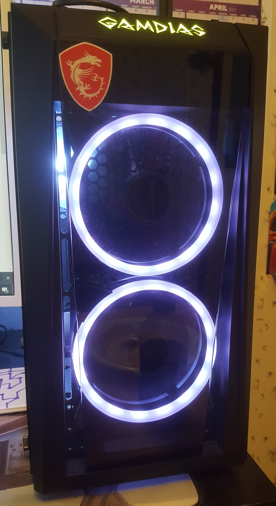
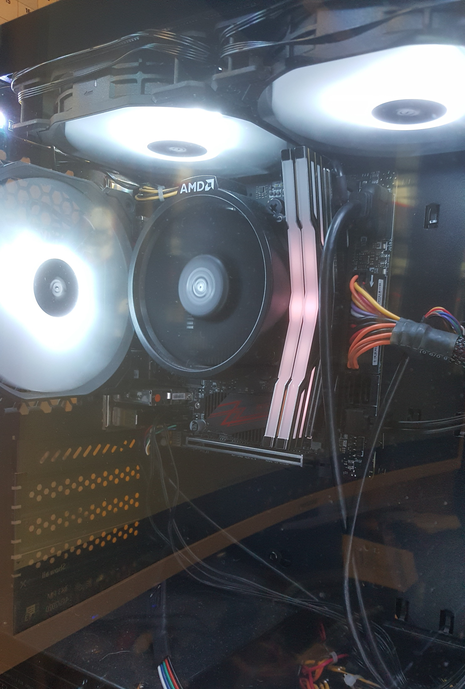

## Ms. Shoemaker's Classes
-------------------------

These classes not only challenged me to think in a precise way, but they also made me push myself to be better.  The coding classes were super fun as me, Ethan Yount and Robert Rexrode made a website using HTML, PHP and CSS.  We worked together to make an amazing looking interface that worked.  The site was a rock n roll site that users could go to if they wanted to know the latest shows that were playing near them.  The site would ask the user what favorite type of music they preferred and got their name and information to search for concerts happening around their area.  It would also suggest other bands and concerts as well.  With the coding class, I was immersed into the world of programming and really enjoyed it.  For the hardware and software support class, I learned a lot about what it takes to build a PC and the proper troubleshooting skills I would need to be an efficient technician.  With Ms. Shoemaker's help and teaching/guidance, I was able to gain the skills it would take to build my own PC!  With the knowledge I gained through her classes, I can confidently say that I have the necessary skills to be an amazing IT professional and even a DevOps engineer someday!

```HTML
<!DOCTYPE html>
<!--  Author:  Roland Estep, Robert Rexrode, and Ethan Yount
      Date:    10 October 2018
	  File:    headbangerzhome.html
	  Purpose: Web page
-->
<html>
<head>
  <title>Headbangerz</title>
  <link href="styles.css" rel="stylesheet" type="text/css" />
</head>
  <div id="header">
  <center></center>
  </div>
  <div id="menu">
	<ul>
		<li><a href="headbangerzhome.html">Home</a></li>
		<li><a href="headbangerznews.html">News</a></li>
		<li><a href="headbangerzgallery.html">Gallery</a></li>
		<li><a href="headbangerzabout.html">About Headbangerz</a></li>
		<li><a href="headbangerzcontact.html">Contact</a></li>
	</ul>
</div>
  <center>
  <p></p>
  <a href="https://www.youtube.com/watch?v=oHg5SJYRHA0"></a>
  <h1>Welcome to Headbangerz!!</h1>

  
  <p><strong>We are dedicated to you as a fan of music to provide the best website!!</strong></p>
  
  <p><a href="headbangerzconcerts.html">Find concerts now!</a></p>
  </center>
</body>
</html>
```

You can find more of this code by visiting [my page](https://github.com/rcestep/headbangerz)!

PC Front | PC Inside
-------- | ---------
 | 

[Go back to Home](https://rcestep.github.io)

[LinkedIn](https://linkedin.com/in/roland-c-estep) | [GitHub](https://github.com/rcestep) | [Discord](https://discordhub.com/profile/532348150019522580)
-------------------------------------------------- | ------------------------------------ | ------------------------------------------------------------
Email: **roland.estep@outlook.com**                | Phone: **(980)892-2512**             |
