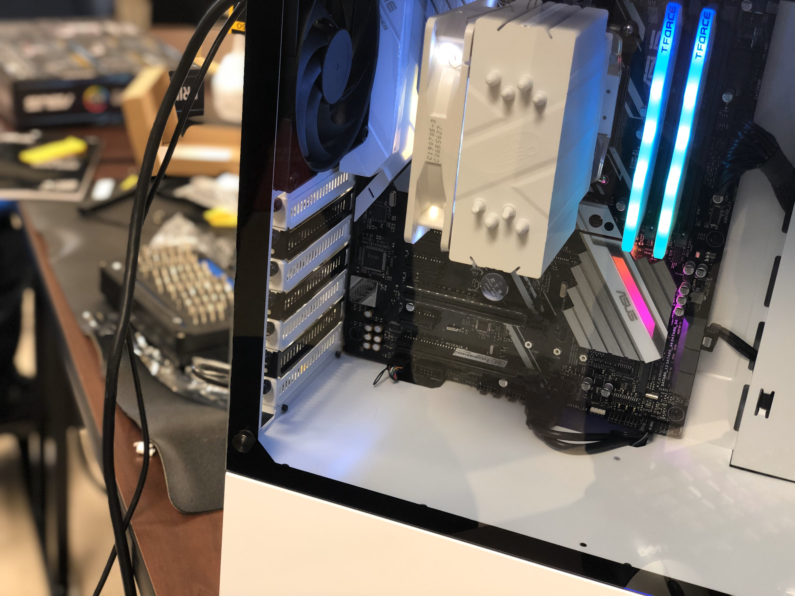
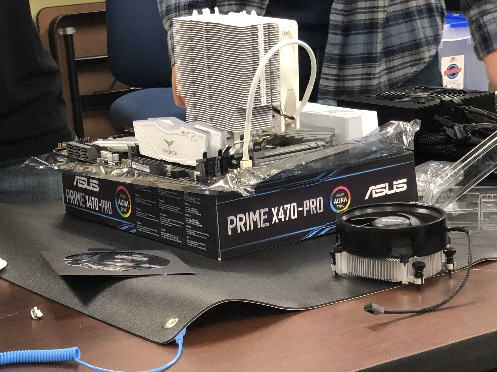
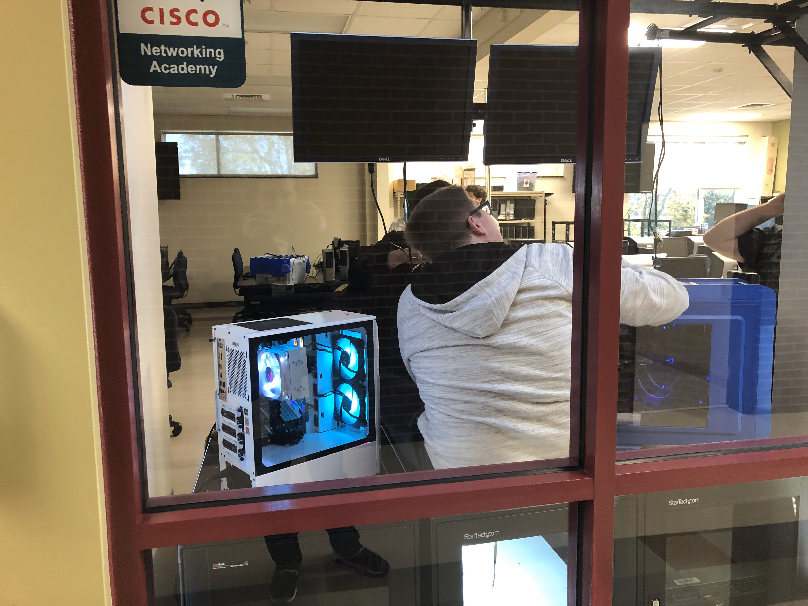

## Mitchell Technological Society
----------------------------------

I played an impacting role in MTS as the Club Representative and later as President to help engage students and get them deeper into IT and promote safe technological use to the community.  The society has become a beacon of light to the students who want to go above and beyond their skills.  We as a team built a PC together and displayed it out to the hallway for other IT students and faculty to see.

Say hi to Traitor!

The team also did many events like promoting technology and teaching tech to middle school children from the Iredell county schools and Mooresville schools around.  To show the future generation what technology can do really helps boost the confidence of many younger students to pursue this field.  The team also went to a business expo and showed the safe and unsafe ways to use technology in the office and showcased two examples of what to do and what not to do in the company.  We had many business owners and business professionals give feedback about it and say that they see many times that it is the what not to do example that is prevalent in the company.  We gave amazing feedback to businesses and showed what could happen in a case of a security breach all because of unaware employees.  Security is becoming a huge factor of what needs to be implemented in a network infrastructure, and to show businesses this need really gave the team a huge experience and be able to reach out to many people around the greater Iredell County area and make sure that these needs are met to better their technological use!

Being President, I led the team to a remote collaboration set due to scheduling problems with some of the team members.  Using different collaboration tools including Discord, Slack, and Microsoft Teams, we were able to keep in touch with each other and keep the ideas flowing even when we could not meet in person.  Using the full remote approach prepped the team as well to get us used to the collaboration that happens in the IT field and we were able to adapt to times of absense from in-person meetings.

Go back to [Home](https://rcestep.github.io)!

[Mr. Cain's Classes](https://rcestep.github.io/mrcainclass/mrcainclass.html)

[Ms. Shoemaker's Classes](https://rcestep.github.io/msshoemakerclass/msshoemakerclass.html)

[Ms. Watt's Classes](https://rcestep.github.io/mswattclass/mswattclass.html)

[Mr. Hicks' Classes](https://rcestep.github.io/mrhicksclass/mrhicksclass.html)

[Mr. Benfield's Class](https://rcestep.github.io/mrbenfieldclass/mrbenfieldclass.html)

[Mr. Theisen's Classes](https://rcestep.github.io/mrtheisenclass/mrtheisenclass.html)

[My Other Accomplishments](https://rcestep.github.io/other/other.html)

[LinkedIn](https://linkedin.com/in/roland-c-estep) | [GitHub](https://github.com/rcestep) | [Discord](https://discordhub.com/profile/532348150019522580)
-------------------------------------------------- | ------------------------------------ | ------------------------------------------------------------
Email: **roland.estep@outlook.com**                | Phone: **(980)892-2512**             |
